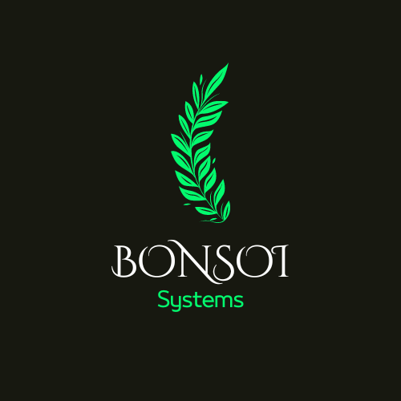

<link rel="icon" type="image/x-icon" href="IMG/favicon.ico" />

# BONSOI-Systems
Engineering Tomorrow: Crafting Digital Futures Today

Welcome to the official Page of BONSOI Systems, a software development company dedicated in creating innovative and high-quality applications. Our GitHub Page serves as the central hub for information about our company and our software solutions.

## About Us

BONSOI Systems is committed to delivering cutting-edge software solutions tailored to meet the unique needs of our clients. We specialize in custom software development, application integration, and consulting services. Our goal is to empower businesses and individuals by providing technology that drives success and transformation.

## Our Services

- **Custom Software Development**: Tailored software solutions designed to fit your business objectives and requirements.
- **Application Integration**: Seamlessly integrate new technologies with your existing systems to enhance productivity.
- **Consulting Services**: Expert guidance to optimize your technology strategy and address complex software challenges.

## Get In Touch

If you're interested in working with us or have any questions, mail me at vishalmaurya850@gmail.com

## How to Contribute

While this repository primarily serves as a portfolio and informational resource, we welcome contributions and feedback. If you have suggestions or would like to collaborate, please reach out to us via the contact information provided on our website.

## License

This repository is licensed under the [APACHE-2.0 License](LICENSE). See the `LICENSE` file for more details.

## Contact

For any inquiries or support, you can contact us at:

- **Email**: vishalmaurya850@gmail.com
- **LinkedIn**: [Vishal Maurya](https://www.linkedin.com/in/vishal-maurya-a0530618b)

---

Thank you for visiting BONSOI Systems. We look forward to collaborating with you and bringing your software ideas to life!
